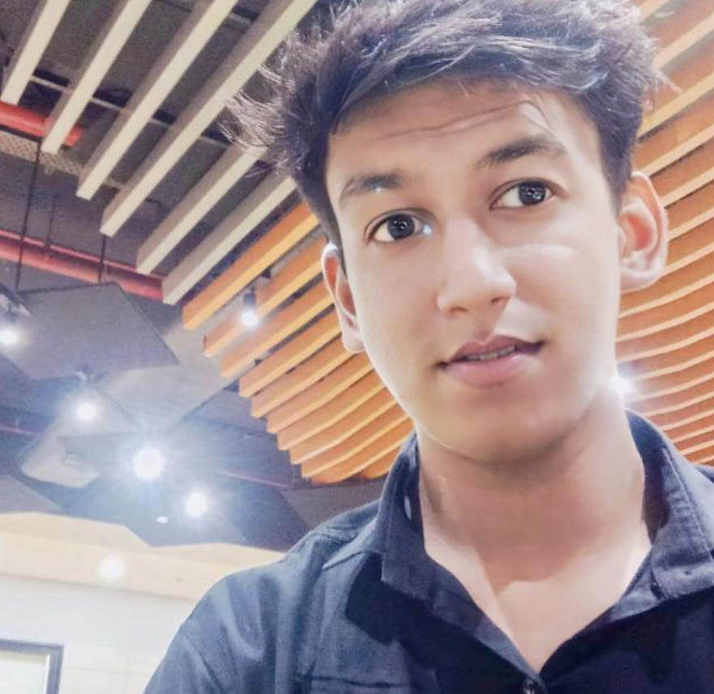

# 🚀 CodeQuity - India's Largest Tech Community

  

  
### **Empowering 50,000+ Developers Across India** 🇮🇳

---

## 👋 Meet the Visionary Behind CodeQuity

  

### **Karan Bansal**  
*Founder & CEO, CodeQuity*

---

## 🎯 What is CodeQuity?

**CodeQuity** is **India's largest and most inclusive tech community**, founded with a revolutionary vision to democratize tech education and create equal opportunities for developers across all backgrounds.

### 🌟 **Our Core Mission**
> **"Making world-class tech education accessible to every Indian developer, regardless of their background, location, or economic status."**

### 📊 **Community Impact by Numbers**
- **50,000+** Active Community Members
- **500+** Tech Events & Workshops Hosted
- **100+** Open Source Projects Initiated
- **25** Indian Cities with Active Chapters
- **10,000+** Developers Placed in Top Tech Companies
- **₹50+ Crores** Worth Scholarships Distributed

---

## 🏗️ CodeQuity's Ecosystem

### 📚 **CodeQuity Learn** - [learn.codequity.in](https://learn.codequity.in)
- **Free Premium Courses** worth ₹50,000+ per student
- **Live Interactive Sessions** with industry experts
- **1:1 Mentorship** from FAANG engineers
- **Real-world Projects** with industry collaboration

### 🎯 **CodeQuity Jobs** - [jobs.codequity.in](https://jobs.codequity.in)
- **Exclusive Job Portal** for community members
- **Direct Hiring** from 500+ partner companies
- **Resume Building** and interview preparation
- **Salary Negotiation** support and guidance

### 🚀 **CodeQuity Projects** - [projects.codequity.in](https://projects.codequity.in)
- **Open Source Contributions** to real-world projects
- **Collaboration with Startups** for live projects
- **Portfolio Building** with industry-relevant projects
- **GitHub Profile Enhancement** with meaningful contributions

### 💬 **CodeQuity Community** - [community.codequity.in](https://community.codequity.in)
- **Discord Server** with 50,000+ members
- **City-wise Chapters** for offline meetups
- **Special Interest Groups** (AI/ML, Web Dev, Mobile, etc.)
- **24/7 Peer Support** and doubt resolution

---

## 🎓 Educational Programs

### 🆓 **100% Free Programs**
- **Full Stack Web Development** (6 months)
- **Data Structures & Algorithms** (4 months)
- **Machine Learning & AI** (5 months)
- **Mobile App Development** (4 months)
- **DevOps & Cloud Computing** (3 months)

### 💼 **Industry Partnerships**
- **Google** - Android Development Program
- **Microsoft** - Azure Cloud Certification
- **Amazon** - AWS Training & Certification
- **Meta** - React & React Native Training
- **Goldman Sachs** - FinTech Development Program

---

## 🌟 Success Stories

### **Real Impact, Real Lives Changed**

> **"CodeQuity transformed my career. From a small town in Bihar to Google Bangalore!"**
> - **Priya Sharma**, Software Engineer @ Google
> - *Came from: Darbhanga, Bihar*
> - *Package: ₹45 LPA*

> **"I got my dream job at Microsoft thanks to CodeQuity's mentorship!"**
> - **Rahul Verma**, SDE @ Microsoft
> - *Background: Tier-3 college, non-CS branch*
> - *Package: ₹35 LPA*

> **"CodeQuity's free courses helped me support my family financially."**
> - **Aisha Khan**, Frontend Developer @ Flipkart
> - *First generation learner from Kashmir*
> - *Package: ₹28 LPA*

---

## 🏆 Awards & Recognition

### **National & International Recognition**
- 🏆 **National Startup Award 2024** - Government of India
- 🥇 **Best EdTech Initiative** - IAMAI Awards 2024
- 🌍 **Top 10 Social Impact Startups** - Forbes India
- 💫 **Best Community Platform** - Product Hunt (Product of the Day)
- 📱 **Most Innovative App** - Google Play Store (Editor's Choice)

### **Media Coverage**
- 📰 **The Hindu** - "Revolutionizing Tech Education in India"
- 📺 **NDTV** - Featured in "Young Turks" startup series
- 🎙️ **The Ranveer Show** - Podcast with 5M+ views
- 📱 **YourStory** - Cover story on "EdTech for Bharat"

---

## 🔗 Connect with CodeQuity

### **🌐 Official Website**
- **Main**: [https://codequity.in](https://codequity.in)
- **Learning**: [https://learn.codequity.in](https://learn.codequity.in)
- **Jobs**: [https://jobs.codequity.in](https://jobs.codequity.in)
- **Community**: [https://community.codequity.in](https://community.codequity.in)

### **📱 Social Media**
- 💬 **Discord**: [discord.gg/codequity](https://discord.gg/codequity)
- 🐦 **Twitter**: [@codequity](https://twitter.com/codequity)
- 📸 **Instagram**: [@codequity](https://instagram.com/codequity)
- 🔗 **LinkedIn**: [CodeQuity Community](https://linkedin.com/company/codequity)
- 📺 **YouTube**: [CodeQuity Channel](https://youtube.com/codequity)

### **📧 Contact Information**
- **Email**: hello@codequity.in
- **Support**: support@codequity.in
- **Partnerships**: partners@codequity.in
- **Media**: media@codequity.in

---

## 🤝 Partnership Opportunities

### **For Companies**
- **Campus Hiring** - Access to pre-trained talent pool
- **Corporate Training** - Customized upskilling programs
- **CSR Partnerships** - Education sponsorship opportunities
- **Technology Partnerships** - Tool access and training

### **For Colleges**
- **Student Chapter Setup** - Establish CodeQuity chapters
- **Faculty Training** - Upskilling college professors
- **Curriculum Integration** - Industry-relevant course integration
- **Placement Support** - Direct campus placement drives

### **For Individual Contributors**
- **Become a Mentor** - Guide the next generation
- **Content Creation** - Create courses and tutorials
- **Open Source Contributions** - Contribute to our projects
- **Campus Ambassador** - Represent CodeQuity in your college

---

## 📊 Community Stats Dashboard

### **Real-time Metrics**
- 🔴 **Live Members**: 50,247 active right now
- 📈 **Daily Growth**: 150+ new members
- 🎓 **Courses Completed**: 25,000+ students
- 💼 **Jobs Secured**: 10,000+ placements
- 💰 **Scholarships**: ₹52 Crores distributed

### **Geographic Reach**
- 📍 **25 Active Cities** across India
- 🏙️ **Top Cities**: Bangalore, Delhi, Mumbai, Hyderabad, Chennai
- 🌍 **Global Reach**: Members from 15+ countries

---

## 🙏 Our Sponsors & Partners

### **Platinum Sponsors**
- **Google** - Technology & Infrastructure Partner
- **Microsoft** - Cloud & Certification Partner
- **Amazon** - AWS & Career Placement Partner
- **Goldman Sachs** - FinTech Education Partner

### **Gold Sponsors**
- **Flipkart**, **Swiggy**, **Zomato**, **Paytm**, **PhonePe**
- **Freshworks**, **Zoho**, **Postman**, **Razorpay**

### **Community Partners**
- **1000+** Hiring Partners
- **500+** College Partnerships
- **50+** Tech Meetup Groups

---

## 🌟 Get Involved Today!

### **For Students - 100% Free**
1. **Join Discord**: [discord.gg/codequity](https://discord.gg/codequity)
2. **Start Learning**: [learn.codequity.in](https://learn.codequity.in)
3. **Apply for Scholarships**: [scholarships.codequity.in](https://scholarships.codequity.in)
4. **Build Portfolio**: [projects.codequity.in](https://projects.codequity.in)

### **For Professionals**
1. **Become a Mentor**: [mentors.codequity.in](https://mentors.codequity.in)
2. **Hire from Us**: [hiring.codequity.in](https://hiring.codequity.in)
3. **Partner with Us**: [partners.codequity.in](https://partners.codequity.in)

---

  
### **Together, we're building the future of Indian tech! 🇮🇳**

⭐ **Star this repository** to support our mission!  
🔄 **Share with your network** to help more developers!  
💬 **Join our Discord** to be part of the community!

---

  
### **Made with ❤️ for the Indian developer community**

