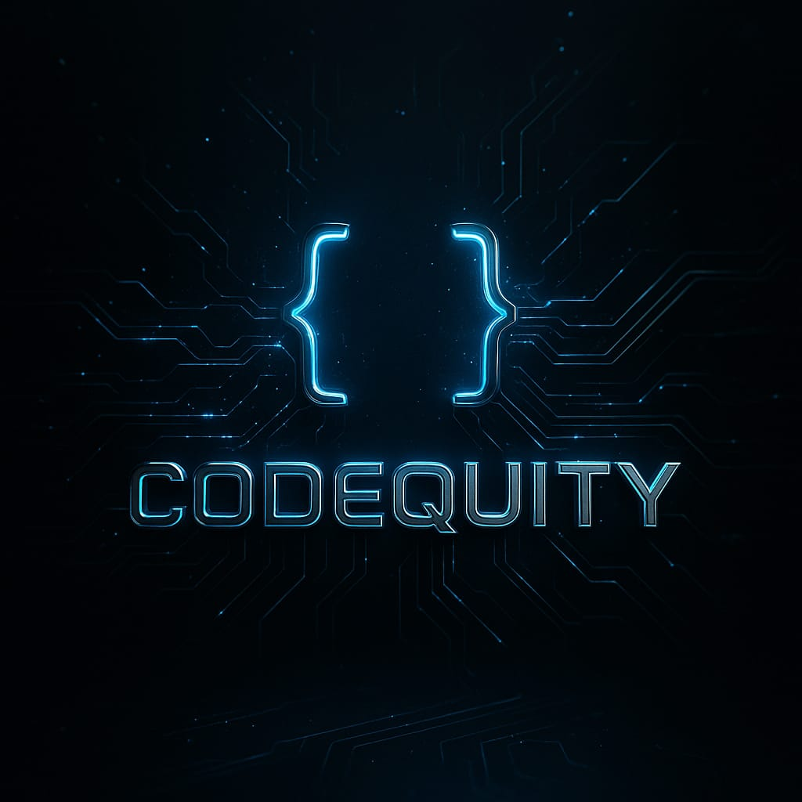

  
  
  # CodeQuity
  **Beyond Limits — India's Definitive Web3 Ecosystem**

---

## 🚀 Overview
CodeQuity is a high-pressure foundry where India's most ambitious builders bridge the gap between idea and on-chain reality. We provide a structured pipeline to transform builders from zero to funded founders in 90 days.

### Why CodeQuity?
- **Not Theory, Real Products:** Ship smart contracts to mainnet within weeks.
- **On-Chain Reputation:** Prove yourself through code, not certificates.
- **Protocol Access:** Direct lines to Polygon, Aptos, Base, and more.

---

## ✨ Features
- **Builder Guild:** Intensive learning on L2s, DeFi, and ZK proofs.
- **Weekly Hackathons:** Competitive sprints with real bounties.
- **Startup Accelerator:** 6-week intensive launchpad for GTM and VC pitching.
- **Elite Network:** Connect with 500+ builders and on-chain architects.

---

---

## 👤 Meet the Founder

  <table border="0">
    <tr>
      <td width="200">
        
      </td>
      <td>
        <h3>KARAN BANSAL</h3>
        
<i>Founder & Architect</i>

        
10+ Web3 hackathon wins. Ships smart contracts at 2 AM. Built VaultBTC & AI Auditor. CodeQuity is the community I wish existed when I started.

        

          
          
        

      </td>
    </tr>
  </table>

---

## 📈 Pre-Launch Status (Q1 2025)
- **500+** Waitlist Applications
- **15+** Partner Protocols in Pipeline
- **₹2Cr+** Grants and VC interest for cohort teams

---

## 📞 Get In Touch
- **WhatsApp Community:** [Join the Guild](https://chat.whatsapp.com/HgPHH53f1v9HV75YOscich)
- **Telegram:** [@codequiity](https://t.me/codequiity)
- **Email:** [codequitycommunity@gmail.com](mailto:codequitycommunity@gmail.com)
- **Instagram:** [@codequity_official](https://www.instagram.com/codequity_official/)

---

Made with ❤️ for the Indian Web3 Ecosystem

